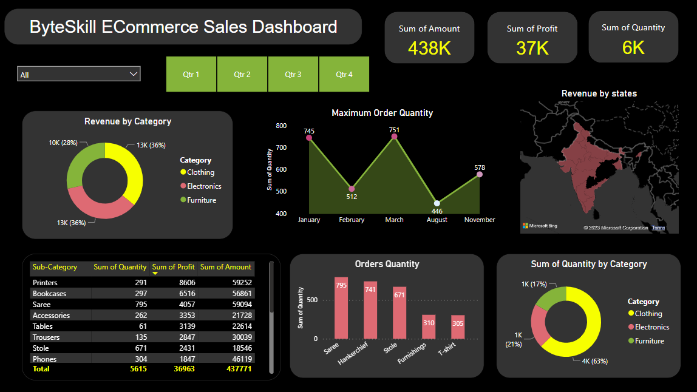

<h1 align="center">ByteSkill Sales Dashboard</h1>

## Overview

This repository contains the analysis of the sales data of ByteSkill using SQL and PowerBI dashboard for ByteSkill's Indian ECommerce sales data. The dashboard provides insights into sales performance across different regions around India and product categories, with a focus on clothing, electronics, and furniture.

## Table of Contents

- [Dashboard Preview](#dashboard-preview)
- [Features](#features)
- [Data Sources](#data-sources)
- [How to Use](#how-to-use)
- [Contributing](#contributing)
- [License](#license)

## Dashboard Preview



<h1><a href="https://app.powerbi.com/links/-9xaa8EIvx?ctid=63b5c61a-66d9-46b2-9b8d-10c275a4acac&pbi_source=linkShare">Click Here</a> to view the published interactive dashboard.</a></h1>

## Features

- **Sales Overview**: Gain a comprehensive view of sales performance over time and by states of India.
- **Product Categories**: Explore sales data, the quantity, the amount and the revenue for clothing, electronics, and furniture categories.
- **Interactive Filters**: Use filters to drill down into specific data points and timeframes.
- **Geographical Insights**: Visualize sales on a world map to identify key markets and the sum of quantity sales.
- **Data Trends**: Analyze trends and make data-driven decisions to optimize sales strategies.

### Extras/Advanced Features
- Created interactice dashboard to track and analyze online sales data of ECommerce data and with a potential use usage of DAX functions.
- used complex parameters to drill down in worksheet and customization using filters and slicers to make the dashboard more interactive and user friendly.
- Created connections, join new tables, calculations to manipulate data and enable user driven parameters for visualizations and dashboards.
- used different types of customized visualization(bar chart, pie chart, donut chart, clustered bar chart, scatter chart, line chart, area chart, map, slicer, etc...)
- Dynamically updates the visualizations based on your interests, and Quartile sales.

## Data Sources

The data for this dashboard is sourced through online data sources and is few data transformations are done for the data integrity.
<a href="dataset/">click here</a> to check the data sources.

## How to Use

To use this dashboard locally or integrate it with your PowerBI environment, follow these steps:

1. Clone this repository to your local machine.

```bash
git clone https://github.com/bharathguntreddi3/ByteSkill_Sales_Dashboard.git
```

open the ByteSkill_Sales_Dashboard.pbix file in PowerBI desktop and refresh the data to get the latest data.

## Contributing

If you'd like to contribute to this project, please follow these guidelines:

- Fork the repository.

- Create a new branch for your feature or bug fix.

- Make your changes and ensure they work as expected.

- Create a pull request with a clear description of your changes.

- Reviewers will assess your pull request, provide feedback, and merge it if appropriate.

## License

This project is licensed under the [MIT License](LICENSE). Feel free to use, modify, and distribute the code as per the terms of the license.

I hope this repository helps you gain valuable insights from your sales data using SQL and RFM analysis. If you have any questions or need further assistance, please feel free to open an issue. Happy analyzing!

If you find this project interesting and useful, show your support by starring ⭐ the repository and sharing it with others. Let's revolutionize productivity together!

## If any necessary commits are required to increase the elegance of this repo! i'm always open for a PR.

## With this signing off..!!, BHARATH GUNTREDDI ..🤞
